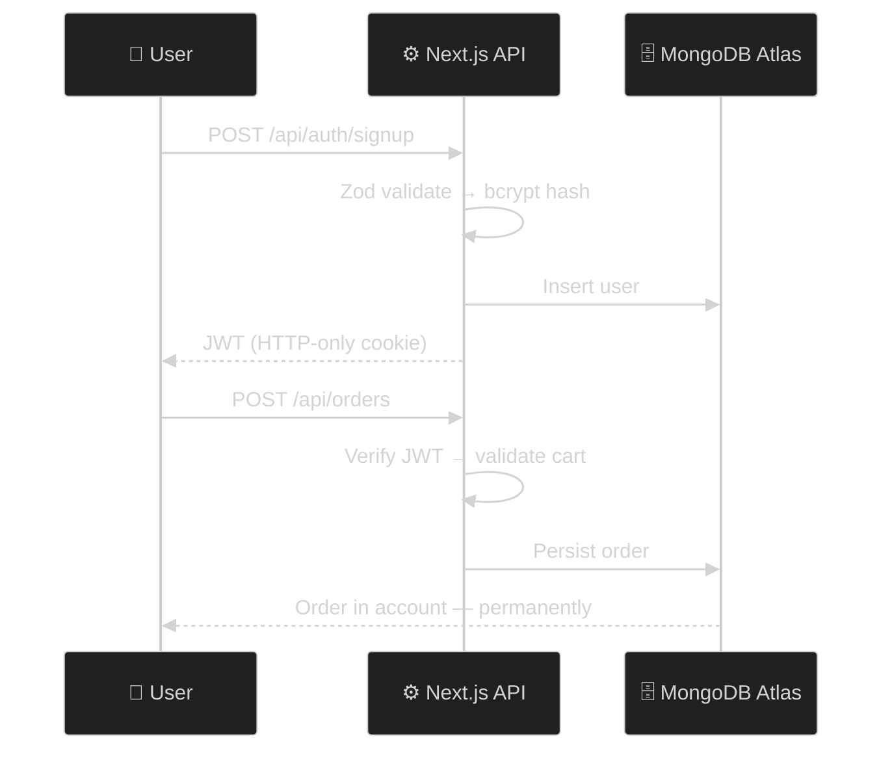

<div align="center">


[](https://nexusmart-dusky.vercel.app)&nbsp;
[](https://github.com/Manashjyoti-Bora/nexusmart)

</div>

> [!NOTE]
> **Most student "e-commerce projects" are UI mockups.** This one is a case file you can verify yourself in under two minutes — real authentication, real database, real persistence.

---

## 🧪 THE 2-MINUTE VERIFICATION CHALLENGE

1. Open **[nexusmart-dusky.vercel.app](https://nexusmart-dusky.vercel.app)**
2. Create an account → password is bcrypt-hashed (12 rounds) before it ever touches the database
3. Add products to cart → checkout → place the order
4. Log out. Close the tab. Come back tomorrow.
5. **Your order is still there.** MongoDB Atlas persistence — no localStorage tricks.
6. Try opening `/admin` → **403.** Role-based access control is real too.

## 🔐 SECURITY LEDGER

| CONTROL | IMPLEMENTATION |
|:---|:---|
| Password storage | bcrypt · 12 salt rounds |
| Sessions | JWT signed with `jose`, delivered in **HTTP-only cookies** — invisible to JS |
| Input validation | Zod schema on **every** mutation route |
| Authorization | Role-gated admin panel — server-side checks, not hidden buttons |
| Secrets | Environment variables only — nothing hardcoded |

## 🏗️ ARCHITECTURE



## 🔧 RUN IT LOCALLY

```bash
git clone https://github.com/Manashjyoti-Bora/nexusmart.git
cd nexusmart && npm install
# .env.local → MONGODB_URI, JWT_SECRET, ADMIN_EMAIL (falls back to demo mode without)
npm run dev
```

## 🧾 ENGINEERING NOTES

- Built end-to-end by one person, on one **Android phone** — Termux, GitHub web editor, Vercel cloud builds
- Demo mode ships with seeded products when no database is configured — the repo always runs
- Hardest bug fought: cookie flags behind Vercel's proxy. Worth it.

<div align="center">

**Run the verification → [nexusmart-dusky.vercel.app](https://nexusmart-dusky.vercel.app)**

<sub>Banner and animations on this page are hand-coded SVG — no generator services.</sub>

</div>
