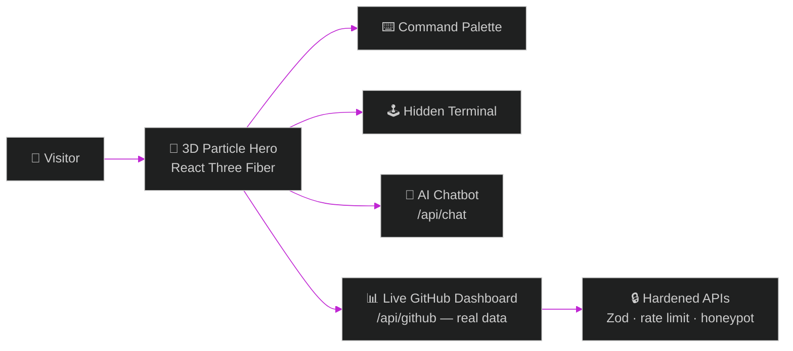

<div align="center">


[](https://manashjyoti-bora.vercel.app)&nbsp;
[](https://github.com/Manashjyoti-Bora/portfolio-website)

</div>

> [!IMPORTANT]
> **This is not a website you read. It is a machine you operate.** This README is its owner's manual. Everything below works right now on the live site — engineered, version-controlled and deployed entirely from an Android phone.

---

## 🕹️ OPERATOR CONTROLS

| INPUT | RESULT |
|:---|:---|
| <kbd>Ctrl</kbd> + <kbd>K</kbd> | Command palette — navigate like a developer tool |
| <kbd>Ctrl</kbd> + <kbd>/</kbd> | Hidden terminal opens. It accepts real commands. |
| `sudo hire-me` | Try it in the terminal. Recruiters love this one. |
| `iddqd` | Legacy cheat code. If you know, you know. |
| <kbd>↑</kbd><kbd>↑</kbd><kbd>↓</kbd><kbd>↓</kbd><kbd>←</kbd><kbd>→</kbd><kbd>←</kbd><kbd>→</kbd><kbd>B</kbd><kbd>A</kbd> | Konami code → confetti. Yes, really. |
| Ask the chatbot | An intent-matching AI answers questions about me |

## ⚙️ WHAT'S UNDER THE HOOD



| SYSTEM | IMPLEMENTATION |
|:---|:---|
| Rendering | Next.js 14 App Router · TypeScript strict |
| Motion | GSAP ScrollTrigger · Framer Motion · Lenis smooth scroll |
| 3D | React Three Fiber particle field — lazy-loaded, never blocks LCP |
| Data | Live GitHub API dashboard (`simulated: false`) |
| Security | CSP + HSTS headers · Zod validation · rate limiting · honeypot |
| SEO | JSON-LD · sitemap · dynamic OG images |

## 🔧 RUN IT LOCALLY

```bash
git clone https://github.com/Manashjyoti-Bora/portfolio-website.git
cd portfolio-website && npm install && npm run dev
```

## 🧾 ENGINEERING NOTES

- Development machine: **Android phone** — Termux for Git, GitHub web editor for code, Vercel for builds
- Every animation is performance-budgeted: the 3D scene loads after LCP, desktop-only
- The terminal, palette and chatbot are hand-rolled — no widget libraries

<div align="center">

**Operate the machine → [manashjyoti-bora.vercel.app](https://manashjyoti-bora.vercel.app)**

<sub>Banner and animations on this page are hand-coded SVG — no generator services.</sub>

</div>
